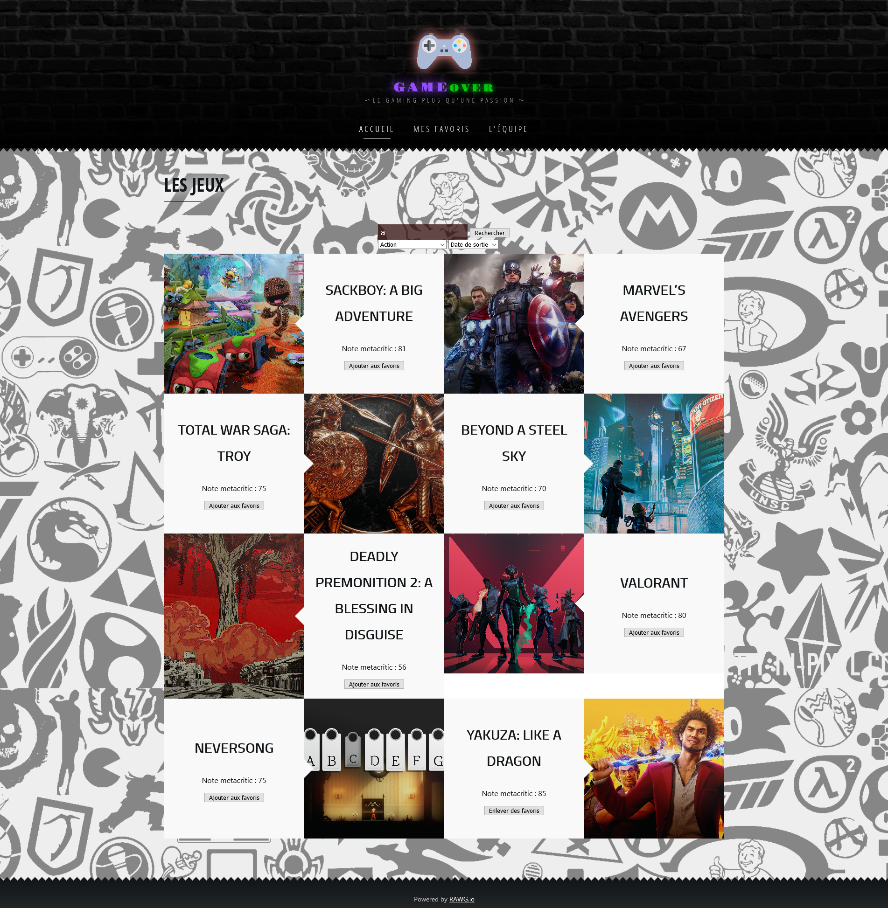
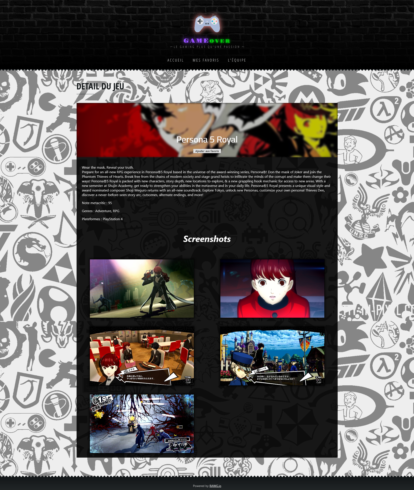
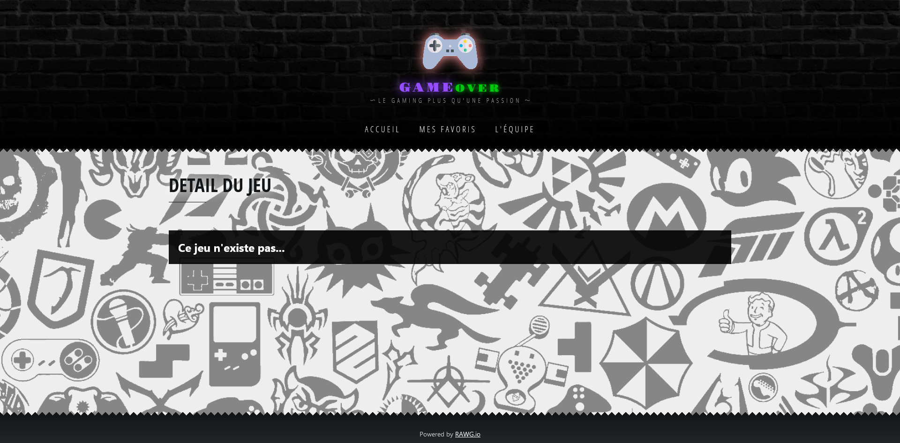
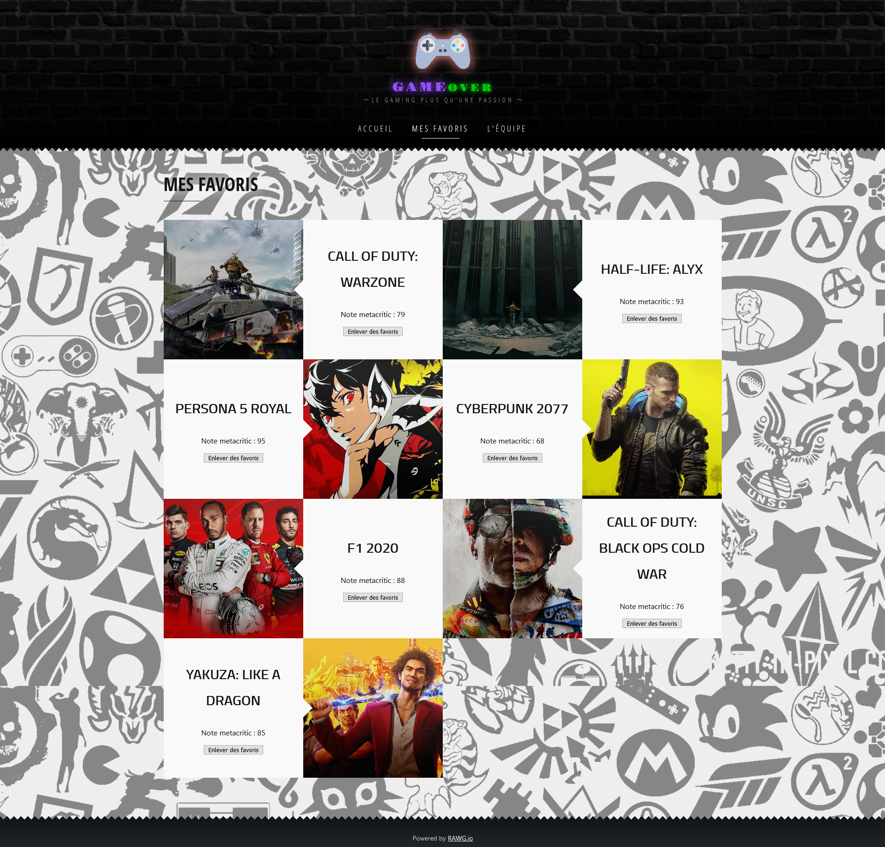
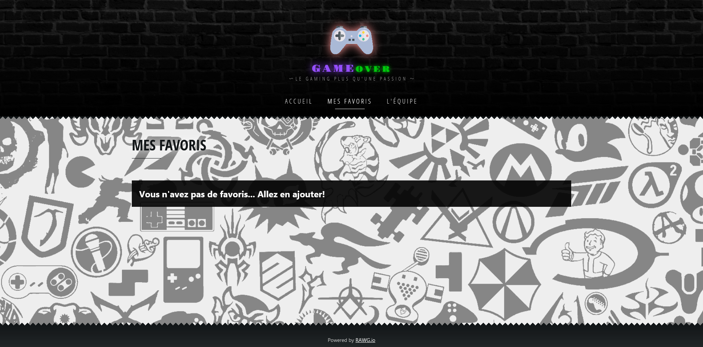
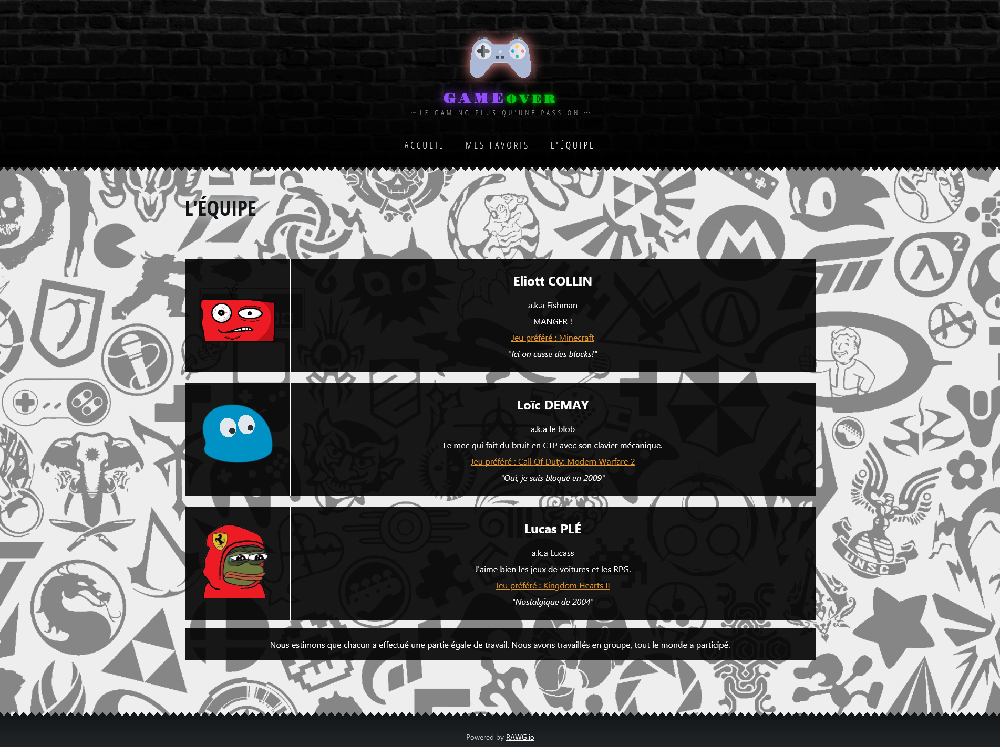

# Projet JS 2021

### Membres

- Loïc DEMAY
- Lucas PLÉ
- Eliott COLIN

### Build

Ajoutez votre clé d'API a `tokenconfig-template.json` puis renommer le fichier a `tokenconfig.json`. Si aucune clé valide n'est donnée (e.g. pas de la taille standard) aucune authentification ne sera faite.

Build :
`npm run build`

Lancer serve :
`npx serve -s -l <port binding>`

### Captures d'écran

    
Page Principale

    
    
Recherche dans la page principale

    
    
Détail : Cyberpunk 2077

    
    
Détail : Persona 5 Royal

    
    
Détail avec un jeu invalide

    
    
Page des favoris

    
    
Page des favoris, sans favoris

    
    
Page de l'équipe

    

